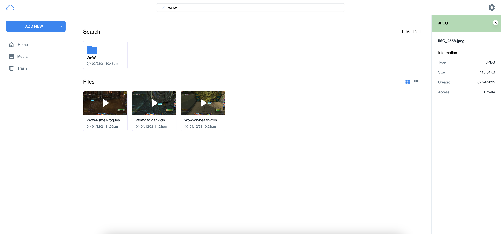

# 

# ☁️ MyDrive

MyDrive is an Open Source cloud file storage server (Similar To Google Drive). Host myDrive on your own server or trusted platform and then access myDrive through your web browser. MyDrive uses mongoDB to store file/folder metadata, and supports multiple databases to store the file chunks, such as Amazon S3, or the Filesystem.

[Main myDrive website](https://mydrive-storage.com/)

## 🔍 Index

- [Features](#features)
- [Installation](#installation)
- [Guided Installation](https://github.com/subnub/myDrive/wiki/Guided-Installation-Setup)
- [Guided Installation (Docker)](<https://github.com/subnub/myDrive/wiki/Guided-Installation-Setup-(Docker)>)
- [Updating from a previous version of myDrive](#updating-from-a-previous-version-of-mydrive)
- [WebUI For Encryption Key](#webui-for-encryption-key)
- [Docker](#docker)
- [Environment Variables](#environment-variables)
- [Screenshots](#screenshots)
- [Wiki](https://github.com/subnub/myDrive/wiki)
- [Video](#video)
- [Demo](#demo)
- [Fund/Donate](#fund)

## ⭐️ Features

- Upload Files
- Download Files
- Upload Folders
- Download Folders (Automatically converts to zip)
- Multiple DB Support (Amazon S3, Filesystem)
- Photo, Video Viewer and Media Gallery
- Generated Photo And Video Thumbnails
- File Sharing
- PWA Support
- AES256 Encryption
- Service Worker
- Mobile Support
- Docker
- Email Verification

## 👨‍🔬 Tech Stack

- React
- Typescript
- Node.js
- Express
- MongoDB
- Vite

## 💻 Installation

Required:

- Node.js (20 Recommended)
- MongoDB (Unless using a service like Atlas)
- FFMPEG (Optional, used for video thumbnails)

<br/>

Setup (Non Docker Method):

> Install Node Modules

```javascript
npm install
```

<br>

> Create Environment Variables:

> You can find enviroment variable examples under: <br />  
> [backend/config](backend/config) -> Backend Enviroment Variables  
> [src/config](src/config) -> Frontend Enviroment Variables

> Simply remove the .example from the end of the filename, and fill in the values.

<br />

> Run the build command

```javascript
npm run build
```

<br />

> Start the server

```javascript
npm run start
```

## 🐳 Docker

Setup:

> Create Environment Variables:

> You can find enviroment variable examples under: <br />  
> [backend/config](backend/config) -> Backend Enviroment Variables  
> [src/config](src/config) -> Frontend Enviroment Variables

> Simply remove the .example from the end of the filename, and fill in the values.

<br />

> Start the Docker image

```javascript
npm run docker:production
```

## 📸 Screenshots

Modern and colorful design


Upload Files


Download Files


Image Viewer


Video Viewer


Image Thumbnails


Share Files


Search For Files/Folders


Move File/Folders


Google Drive Support


## 🎥 Video

I created a short YouTube video, showing off myDrives design and features: https://www.youtube.com/watch?v=_bcADP6hDDI&feature=youtu.be

## 🕹️ Live demo

Demo: https://mydrive-3.herokuapp.com/

- Note: The Upload and Download Features, and other core features, are disabled in the demo.

## 👾 Questions? Feature Requests? Issues?

Contact Email: kyle.hoell@gmail.com

## ⬆️ Updating from a previous version of myDrive

If you are upgrading from myDrive 3 there is some data migration and scripts you must run for myDrive 4 to work properly.

> Run the migration script <br />
> Note: Make sure you have env variables set

```javascript
npm run migrate-to-mydrive4
```

Also, if you are updating from myDrive 3, or if you did not have video thumbnails enabled and would like to enable them now you can do so by running the following command:<br />
Note: Make sure you have video thumbnails enabled in your env variables and FFMPEG installed.

```javascript
npm run create-video-thumbnails
```
